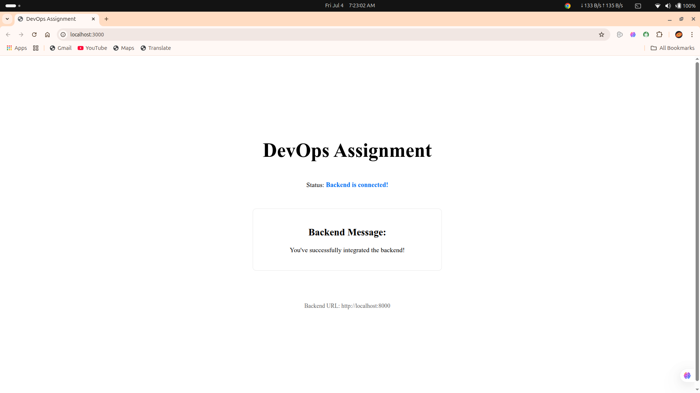

# DevOps Assignment: Two-Tier Web Application

This repository demonstrates an end-to-end DevOps workflow for a simple two-tier web application. It showcases containerization of a FastAPI backend and a Next.js frontend, local deployment with Docker, and multi-service orchestration using Docker Compose.

## 🚀 Project Objective

The goal of this assignment is to:

* Containerize a FastAPI backend and a Next.js frontend.
* Deploy and operate the application using Docker and Docker Compose.
* Automate local development workflows.
* Apply multi-stage Dockerfile patterns for optimized builds.
* Understand environment variable propagation across containers.

## ✨ Features

* Lightweight FastAPI backend with health and message endpoints.
* Next.js frontend that consumes the backend API.
* CORS configuration for cross-origin requests.
* Multi-stage Docker builds to reduce image size.
* One-command startup with Docker Compose.

## 🏗️ Project Structure
```
DevOps-Assignment/
├── backend/
│   ├── app/
│   │   └── main.py              # FastAPI application entry point
│   ├── requirements.txt         # Python dependencies
│   └── Dockerfile               # Dockerfile for the FastAPI backend
├── frontend/
│   ├── pages/
│   │   └── index.js             # Next.js frontend page
│   ├── package.json             # Node.js dependencies
│   ├── .env.production          # Environment variables for production build
│   └── Dockerfile               # Dockerfile for the Next.js frontend
├── docker-compose.yml           # Docker Compose configuration for both services
└── README.md                    # Project documentation 
```

## 🌐 Application Overview

This project comprises two main services: a FastAPI backend and a Next.js frontend.

### Backend (FastAPI)

The backend is a lightweight API built with FastAPI, providing two essential endpoints:

* `/api/health`: A health check endpoint to confirm the backend is operational.
* `/api/message`: An endpoint that returns a success message, demonstrating successful integration.

**File:** `backend/app/main.py`
```python
# Example snippet (or full content if short)
from fastapi import FastAPI
from fastapi.middleware.cors import CORSMiddleware # Assuming you have CORS configured

app = FastAPI()

# Add CORS middleware if needed for local development
app.add_middleware(
    CORSMiddleware,
    allow_origins=["*"], # Adjust as needed for production
    allow_credentials=True,
    allow_methods=["*"],
    allow_headers=["*"],
)

@app.get("/api/health")
async def health_check():
    return {"status": "healthy", "message": "Backend is running successfully"}

@app.get("/api/message")
async def get_message():
    return {"message": "You've successfully integrated the backend!"}

## Frontend (Next.js)

 The frontend is a Next.js application responsible for displaying the status of the backend connection and the message retrieved from the /api/message endpoint. It fetches data from the backend using the configured API URL.

 File: frontend/pages/index.js
 // Example snippet (or full content if short)
import { useEffect, useState } from 'react';

export default function Home() {
  const [healthStatus, setHealthStatus] = useState('Checking...');
  const [backendMessage, setBackendMessage] = useState('Connecting...');
  const backendUrl = process.env.NEXT_PUBLIC_API_URL || 'http://localhost:8000'; // Default for local dev

  useEffect(() => {
    // Fetch health status
    fetch(`${backendUrl}/api/health`)
      .then(res => res.json())
      .then(data => setHealthStatus(data.message || data.status))
      .catch(() => setHealthStatus('Failed to connect to backend health endpoint.'));

    // Fetch integration message
    fetch(`${backendUrl}/api/message`)
      .then(res => res.json())
      .then(data => setBackendMessage(data.message))
      .catch(() => setBackendMessage('Failed to fetch integration message.'));
  }, [backendUrl]);

  return (
    <div style={{ padding: '20px', fontFamily: 'Arial, sans-serif' }}>
      <h1>DevOps Assignment</h1>
      <div style={{ border: '1px solid #ccc', padding: '15px', borderRadius: '8px', maxWidth: '400px', margin: '20px auto' }}>
        <p><strong>Status:</strong> {healthStatus}</p>
        <p><strong>Backend Message:</strong> {backendMessage}</p>
      </div>
      <p style={{ textAlign: 'center', fontSize: '0.9em', color: '#666' }}>Backend URL: {backendUrl}</p>
    </div>
  );
}

## 🐳 Containerization with Docker
   Both the backend and frontend are containerized using multi-stage Dockerfiles for efficient and optimized image builds.

- Backend Dockerfile (backend/Dockerfile)

  FROM python:3.11-slim AS builder
  WORKDIR /app
  COPY requirements.txt .
  RUN pip install --user -r requirements.txt

  FROM python:3.11-slim
  WORKDIR /app
  COPY --from=builder /root/.local /root/.local
  ENV PATH="/root/.local/bin:$PATH"
  COPY app/ ./app
  CMD ["uvicorn", "app.main:app", "--host", "0.0.0.0", "--port", "8000"]

## Frontend Dockerfile (frontend/Dockerfile)

  FROM node:18-alpine AS deps
  WORKDIR /app
  COPY package.json package-lock.json ./
  RUN npm install

FROM node:18-alpine AS builder
WORKDIR /app
COPY --from=deps /app/node_modules ./node_modules
COPY . .
RUN npm run build

FROM node:18-alpine AS runner
WORKDIR /app
ENV NODE_ENV=production
COPY --from=builder /app/public ./public
COPY --from=builder /app/.next ./.next
COPY --from=builder /app/node_modules ./node_modules
COPY --from=builder /app/package.json ./package.json
EXPOSE 3000
CMD ["npm", "start"]

📸 Screenshots

1. Docker Compose Logs
Demonstrates the build and startup logs when running docker compose up, showing both backend and frontend services starting 


2. Running Containers Status
Output of docker ps, confirming both backend (pgagi-backend) and frontend (pgagi-frontend) containers are up and running, along with their exposed ports


3. Frontend UI (localhost:3000)
A view of the web application's user interface in the browser, showing the "Backend is connected!" status and the "You've successfully integrated the backend!" message


4. Backend Health Check Response (localhost:8000/api/health)
The JSON response in the browser from the backend's health endpoint, confirming its successful operation


